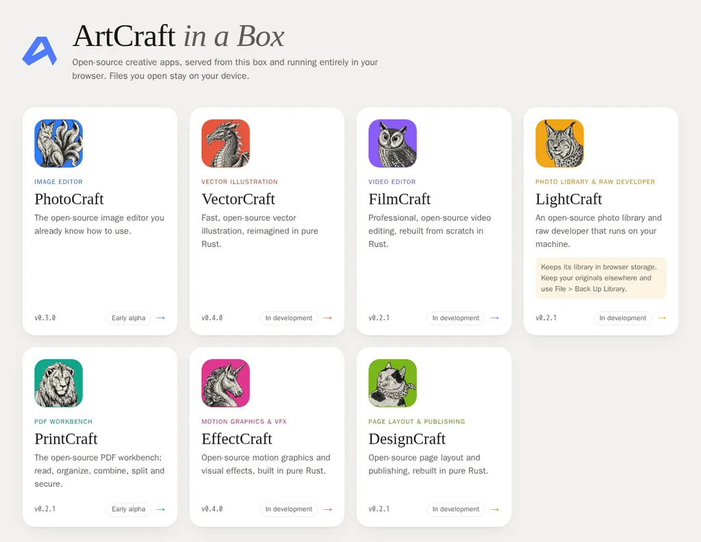

# ArtCraft in a Box

One container that self-hosts the [ArtCraft](https://getartcraft.com/apps) open-source creative apps:
an nginx image with each app in its own sub-folder and a tile overview page at `/`.



| Path | App | |
|---|---|---|
| `/photocraft/` | PhotoCraft | Image editor |
| `/vectorcraft/` | VectorCraft | Vector illustration |
| `/filmcraft/` | FilmCraft | Video editor |
| `/lightcraft/` | LightCraft | Photo library & raw developer |
| `/printcraft/` | PrintCraft | PDF workbench |
| `/effectcraft/` | EffectCraft | Motion graphics & VFX |
| `/designcraft/` | DesignCraft | Page layout & publishing |

The apps are Rust compiled to WebAssembly. They run entirely in the browser: there is no server-side
code, and files you open never leave your machine.

## Run it

```sh
docker run -d --name artcraft -p 8080:8080 ghcr.io/sbuchweitz/artcraft-in-a-box:latest
```

Open <http://localhost:8080>. The image runs nginx as a non-root user on port 8080 and works with a
read-only root filesystem; [`compose.yaml`](compose.yaml) shows a locked-down setup.

**Use HTTPS for anything but localhost.** Browsers only give WebGPU, the clipboard and the
file-system storage LightCraft keeps its library in to secure contexts. Over plain HTTP the apps
fall back to WebGL2 and LightCraft can't store anything, and the landing page says so. Put the
container behind your usual TLS-terminating reverse proxy (Traefik, Caddy, Nginx Proxy Manager,
SWAG, ...). Every URL is relative, so the site also works under a path prefix.

Endpoints besides the apps: `/healthz` (liveness, also used by the image's `HEALTHCHECK`) and
`/versions.json` (which app versions this image serves).

## How it works

[`apps.json`](apps.json) is the single source of truth: per app the GitHub repo, the release tag,
the `<id>-web-<version>.zip` asset and its pinned SHA-256, plus the tile text, icon and accent colour.

The [`Dockerfile`](Dockerfile) has two stages:

1. **site** (Python, runs once on the build host's architecture): `python -m artbox.build`
   downloads each zip (cached across builds in a BuildKit cache mount), checks its SHA-256, unpacks
   it into `/<id>/`, prunes files that shouldn't be served, renders the landing page from
   [`site/index.html.tmpl`](site/index.html.tmpl) and gzips every large text or wasm file.
2. **runtime** (`nginxinc/nginx-unprivileged`): copies in [`nginx/default.conf`](nginx/default.conf)
   and the generated site. No `RUN` steps, so the `linux/arm64` image needs no emulation.

Serving details, following each app's `HOSTING.md`:

- **Compression.** The big files are stored gzip-only: 279 MB of wasm becomes 107 MB. nginx sends
  them with `gzip_static always` and decompresses on the fly (`gunzip on`) for the rare client
  without gzip. The image is about 170 MB; keeping raw copies too would make it about 450 MB.
- **Caching.** Content-hashed files (`photocraft-web-72921900975c7e6f_bg.wasm`) get
  `Cache-Control: public, max-age=31536000, immutable`. Everything else keeps its name across
  releases and gets `no-cache` (revalidate, cheap `304`s).
- **MIME types.** `.wasm` is served as `application/wasm`, so browsers can stream-compile it.
- **Headers.** `X-Content-Type-Options: nosniff` everywhere, a strict CSP on the landing page.
  There's no `X-Frame-Options`, so the apps can be embedded in an iframe.
- **Pruning.** Netlify/Apache header samples (`_headers`, `.htaccess`) and upstream `.gz`/`.br`
  copies are dropped. LightCraft 0.2.1's zip also contains about 100 MB of Cargo build output
  (`build/`, `deps/`, `.fingerprint/`, ...). That is removed whenever Cargo markers are present.
  nginx never serves dotfiles.

## Pipeline

| Workflow | Trigger | What it does |
|---|---|---|
| [`build`](.github/workflows/build.yml) | push to `main`, `v*` tags, PRs, manual | lint + unit tests → build → [smoke test](tests/smoke.sh) → push `linux/amd64` + `linux/arm64` to GHCR (not for PRs) |
| [`update-apps`](.github/workflows/update-apps.yml) | daily 04:23 UTC, manual | pins `apps.json` to each repo's latest release, commits the bump to `main`, starts `build` |

Image tags: `latest` (main), `sha-<commit>`, and `X.Y.Z` / `X.Y` for `vX.Y.Z` git tags. Builds
carry SBOM and provenance attestations.

The version bump takes each checksum from GitHub's asset digest and checks it against the release's
`SHA256SUMS.txt`. If they disagree, nothing is committed. A release without a web build keeps the
previous version. Dependabot keeps the base images and actions current.

The smoke test runs the image read-only with all capabilities dropped, then checks every app over
HTTP from inside the container: status codes, `application/wasm`, gzip and identity encodings, the
cache rules, relative redirects, and that pruned files aren't served.

## Develop

```sh
make check          # ruff + pytest (coverage gate 80 %)
make smoke          # build the image and smoke-test it
make run            # build and serve on http://localhost:8080
make check-updates  # list newer upstream releases
make update         # pin apps.json to them
make site           # build the static site into dist/ without Docker
```

To add an app, append an entry to `apps.json` and put a square icon in `site/assets/icons/`. The
release must ship a `<id>-web-<version>.zip` whose `index.html` uses relative URLs. Run
`make update` to pin it to its latest release.

## Credits

The apps are made by the [ArtCraft](https://getartcraft.com) project
([github.com/storytold](https://github.com/storytold)) and are dual-licensed Apache-2.0 / MIT. Their
license files ship inside each app's folder in the image. App icons and the ArtCraft logo come from
[getartcraft.com](https://getartcraft.com/apps).
